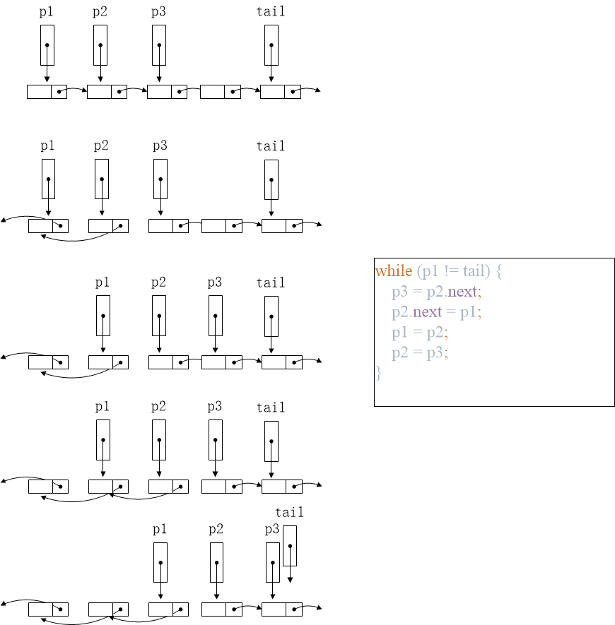

### 25. Reverse Nodes in k-Group

- Given a linked list, reverse the nodes of a linked list *k* at a time and return its modified list.

  *k* is a positive integer and is less than or equal to the length of the linked list. If the number of nodes is not a multiple of *k* then left-out nodes in the end should remain as it is.

  **Example:**

  Given this linked list: `1->2->3->4->5`

  For *k* = 2, you should return: `2->1->4->3->5`

  For *k* = 3, you should return: `3->2->1->4->5`

  **Note:**

  - Only constant extra memory is allowed.
  - You may not alter the values in the list's nodes, only nodes itself may be changed.

#### 思路（[代码](./Solution.java)）

在题24的基础上扩展，将仅限于相邻2个节点的逆序扩展至*k*个节点。**注意**：对于列表逆序问题，数组和链表是不同的！对于数组，因为索引（下标）不可更改，故只能从首尾两两交换元素直至中点；而对于链表，索引（next指针）是可以更改的，只需逐个节点修改next指针的方向，最终的尾节点即是逆序的头结点。

对于链表节点操作这类问题，最直观有效的解决方案就是动手画图，指针的修改逻辑一目了然！如下图：

