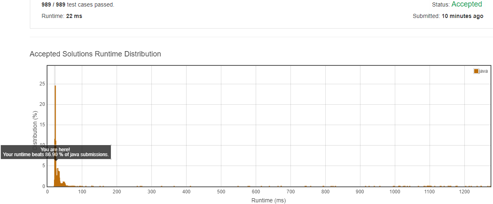

### 29. Divide Two Integers

Given two integers `dividend` and `divisor`, divide two integers without using multiplication, division and mod operator.

Return the quotient after dividing `dividend` by `divisor`.

The integer division should truncate toward zero.

**Example 1:**

```
Input: dividend = 10, divisor = 3
Output: 3
```

**Example 2:**

```
Input: dividend = 7, divisor = -3
Output: -2
```

**Note:**

- Both dividend and divisor will be 32-bit signed integers.
- The divisor will never be 0.
- Assume we are dealing with an environment which could only store integers within the 32-bit signed integer range: [−231,  231 − 1]. For the purpose of this problem, assume that your function returns 231 − 1 when the division result overflows.

#### 思路（[代码](Solution.java)）

这道题AC不容易，连续折腾了两个晚上。先贴个图，小有成就一把



基本思路：先判断最终的符号，然后将除数和被除数都转为正数，接着，用减法代替除法，通过多次减去除数，达到除法效果。

##### 难点在于：

+ **边界情况**。时刻要防止溢出！例如，除数/被除数转为正数时，直接取反可能溢出（比如-2147483648），考虑以退为进，先+1，然后再适当的时机再-1。再比如，`n--`或`n-doubleCount`时，直接减可能会溢出，要先判断，然后选择继续还是直接返回溢出值。
+ **如何减的更快**，让减数成倍扩大，然后成倍缩小。经历了多次的**Time Limit Exceeded**，一步步优化。

##### 最后

贴一下让人心累的图，


